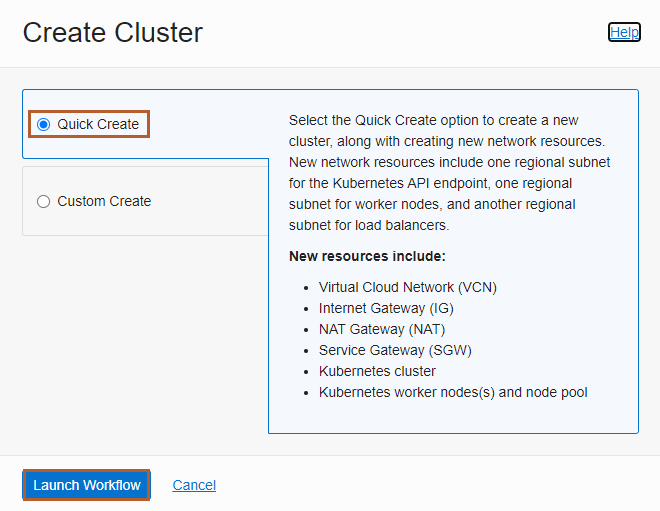
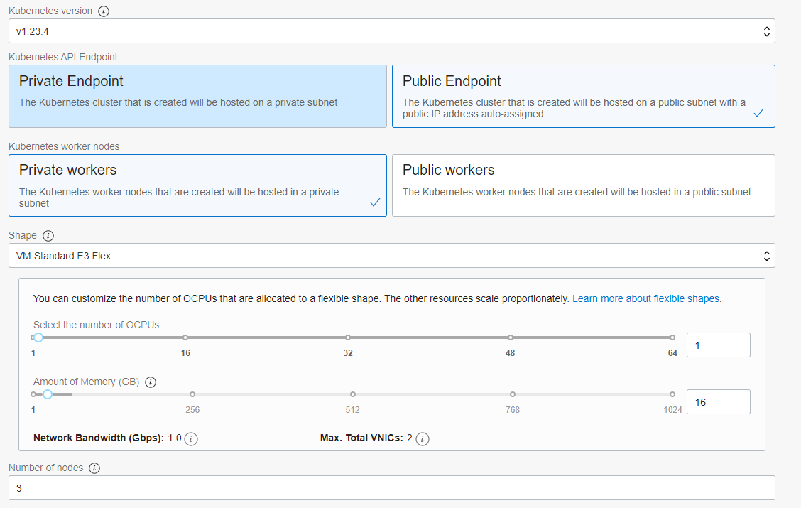
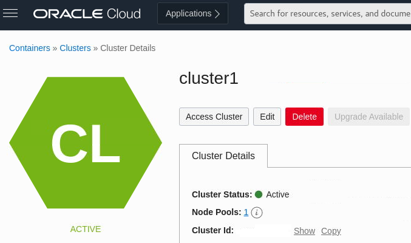

# Kubeflow for Oracle Container Engine for Kubernetes

[uri-kubernetes]: https://kubernetes.io/
[uri-oci]: https://cloud.oracle.com/cloud-infrastructure
[uri-oracle]: https://www.oracle.com

[](https://img.shields.io/badge/license-UPL-green) [](https://sonarcloud.io/dashboard?id=oracle-devrel_kubeflow-oke)

## Table of Contents

- [Kubeflow for Oracle Container Engine for Kubernetes](#kubeflow-for-oracle-container-engine-for-kubernetes)
  - [Table of Contents](#table-of-contents)
  - [Introduction](#introduction)
  - [Getting Started](#getting-started)
  - [Installation](#installation)
    - [Prerequisites](#prerequisites)
    - [Create an OKE cluster](#create-an-oke-cluster)
  - [Install Kubeflow](#install-kubeflow)
  - [Prerequisites](#prerequisites-1)
    - [Preparation](#preparation)
  - [Accessing the Kubeflow Dashboard](#accessing-the-kubeflow-dashboard)
      - [Enable HTTPS](#enable-https)
  - [URLs](#urls)
  - [Contributing](#contributing)
  - [License](#license)

## Introduction

Oracle Container Engine for Kubernetes (OKE) is the [Oracle][uri-oracle]-managed [Kubernetes][uri-kubernetes] service on [Oracle Cloud Infrastructure (OCI)][uri-oci].

## Getting Started

> ⚠️ Kubeflow 1.5.0 is not compatible with Kubernetes version 1.22 and onwards. To install Kubeflow 1.5.0 or older, set the Kubernetes version of your OKE cluster to v1.21.5.

This guide explains how to install Kubeflow 1.6.0 on OKE using Kubernetes versions 1.22.5, 1.23.4 and 1.24.1.

## Installation

This guide describes how to create a Kubernetes cluster using OKE, access OKE, install Kubeflow and expose Kubeflow Dashboard.

### Prerequisites

This guide can be run in many different ways, but in all cases, you will need to be signed into an Oracle Cloud Infrastructure tenancy.

This guide uses the [Cloud Shell](https://docs.oracle.com/en-us/iaas/Content/API/Concepts/devcloudshellintro.htm) built into the Oracle Cloud Console but can also be run from your local workstation.

### Create an OKE cluster

1. In the Console, open the navigation menu and click **Developer Services**. Under **Containers & Artifacts**, click **Kubernetes Clusters (OKE)**.

    

2. On the Cluster List dialog, select the Compartment where you are allowed to create a cluster and then click **Create Cluster**.

    > You must select a compartment that allows you to create a cluster and a repository inside the Oracle Container Registry.

    

3. On the Create Cluster dialog, click **Quick Create** and click **Launch Workflow**.

    

    *Quick Create* will automatically create a new cluster with the default settings and new network resources for the new cluster.

4. Specify the following configuration details on the Cluster Creation dialog paying close attention to the value you use in the **Shape** field:

    - **Name**: The name of the cluster. Accept the default value or provide your own.
    - **Compartment**: The name of the compartment. Accept the default value or provide your own.
    - **Kubernetes Version**: The version of Kubernetes. Select the **v1.23.4** version.
    - **Kubernetes API Endpoint**: Determines if the cluster control plane nodes will be directly accessible from external sources. Select the **Public Endpoint** value.
    - **Kubernetes Worker Nodes**: Determines if the cluster worker nodes will be directly accessible from external sources. Accept the default value **Private Workers**.
    - **Shape**: The shape to use for each node in the node pool. The shape determines the number of OCPUs and the amount of memory allocated to each node. The list shows only those shapes available in your tenancy that are supported by OKE.
    - **Number of nodes**: The number of worker nodes to create. Accept the default value **3**.
    > **Caution**: *VM.Standard.E4.Flex is the recommended shape but is not available to Always Free tenancies. You should adjust the shape based on your requirements and location.*

  

1. Click **Next** to review the details you entered for the new cluster.

2. On the Review page, click **Create Cluster** to create the new network resources and the new cluster.

    You see the network resources being created for you. Wait until the request to create the node pool is initiated and then click **Close**.

    

    The new cluster is shown on the Cluster Details page. When the control plane nodes are created, the status of new cluster becomes *Active*. This usually takes around 10 minutes.

    

    

    Now that your OKE cluster is ready, we can move on to the Kubeflow installation.

## Install Kubeflow

## Prerequisites

The following utilities are required to install Kubeflow:

- [OCI-CLI](https://docs.oracle.com/en-us/iaas/Content/API/Concepts/cliconcepts.htm)
- [kubectl](https://kubernetes.io/docs/reference/kubectl/)
- [git](https://git-scm.com/)

These tools are installed by default in your Cloud Shell instance.

> **Warning:** use [Kustomize v3.2.0](https://github.com/kubernetes-sigs/kustomize/releases/tag/v3.2.0) as Kubeflow 1.6.0 is not compatible with the later versions of Kustomize.

### Preparation

1. Install Kustomize in Cloud Shell

    - Open Cloud Shell

    - Make sure you are in your home directory

            cd ~

    - Download Kustomize v3.2.0 and install it in your Cloud Shell environment.

            curl -sfL https://github.com/kubernetes-sigs/kustomize/releases/download/v3.2.0/kustomize_3.2.0_linux_amd64 -o kustomize
            chmod +x ./kustomize

2. Clone the v1.6.0 branch of the Kubeflow manifests repository to your Cloud Shell environment

        git clone -b v1.6-branch https://github.com/kubeflow/manifests.git kubeflow-1.6
        cd kubeflow-1.6

3. Replace the default email address and password used by Kubeflow with a randomly generated one:
    
   ```shell
   $ PASSWD=$(cat /dev/urandom | tr -dc 'a-zA-Z0-9' | fold -w 55 | head -n 1)
   $ KF_PASSWD=$(htpasswd -nbBC 12 USER $PASSWORD| sed -r 's/^.{5}//')
   $ sed -i.orig "s|hash:.*|hash: $KF_PASSWD|" common/dex/base/config-map.yaml 
   $ echo "Random password is: $PASSWD"

## Install Kubeflow

1. To access your OKE cluster, click **Access Cluster** on the cluster detail page. Accept the default **Cloud Shell Access** and click **Copy** to copy the `oci ce cluster create-kubeconfig ...` command. Next, paste it into your Cloud Shell session and hit **Enter**.

  

  Verify that the `kubectl` is working by using the `get nodes` command. You may need to repeat this command several times until all three nodes show `Ready` in the `STATUS` column.

  ```bash
    $ kubectl get nodes
    NAME          STATUS   ROLES   AGE   VERSION
    10.0.10.176   Ready    node    19m   v1.23.4
    10.0.10.203   Ready    node    19m   v1.23.4
    10.0.10.48    Ready    node    19m   v1.23.4
  ```

  When all three nodes are `Ready`, your OKE install has finished successfully.

2. Install Kubeflow with a single command

        cd $HOME/kubeflow-1.6 
        while ! $HOME/kustomize build example | kubectl apply -f -; do echo "Retrying to apply resources"; sleep 10; done

Installation usually takes between 10 to 15 minutes.

Use the following commands to check if all the pods related to Kubeflow are ready:

  ```bash
kubectl get pods -n cert-manager
kubectl get pods -n istio-system
kubectl get pods -n auth
kubectl get pods -n knative-eventing
kubectl get pods -n knative-serving
kubectl get pods -n kubeflow
kubectl get pods -n kubeflow-user-example-com
 ```

It usually takes about 15 minutes for all the pods to start successfully.

## Accessing the Kubeflow Dashboard

To enable access to the Kubeflow Dashboard from the internet, we first need to change the default `istio-ingressgateway` service created by Kubeflow into a `LoadBalancer` service using the following commands:

```
cat <<EOF | tee $HOME/kubeflow_1.6/patchservice_lb.yaml
  spec:
    type: LoadBalancer
  metadata:
    annotations:
      oci.oraclecloud.com/load-balancer-type: "lb"
      service.beta.kubernetes.io/oci-load-balancer-shape: "flexible"
      service.beta.kubernetes.io/oci-load-balancer-shape-flex-min: "10"
      service.beta.kubernetes.io/oci-load-balancer-shape-flex-max: "100"
EOF
```
    kubectl patch svc istio-ingressgateway -n istio-system -p "$(cat $HOME/kubeflow_1.6/patchservice_lb.yaml)"

#### Enable HTTPS

  * Create a Kubernetes Secret to store the certificate

        cd $HOME/kubeflow-ssl
        kubectl create secret tls kubeflow-tls-cert --key=$DOMAIN.key --cert=$DOMAIN.crt -n istio-system    

  * Update the Kubeflow API Gateway definition

  Create API Gateway

        cat <<EOF | tee $HOME/kubeflow_1.6/sslenableingress.yaml
        apiVersion: v1
        items:
        - apiVersion: networking.istio.io/v1beta1
          kind: Gateway
          metadata:
            annotations:
            name: kubeflow-gateway
            namespace: kubeflow
          spec:
            selector:
              istio: ingressgateway
            servers:
            - hosts:
              - "*"
              port:
                name: https
                number: 443
                protocol: HTTPS
              tls:
                mode: SIMPLE
                credentialName: kubeflow-tls-cert
            - hosts:
              - "*"
              port:
                name: http
                number: 80
                protocol: HTTP
              tls:
                httpsRedirect: true
        kind: List
        metadata:
          resourceVersion: ""
          selfLink: ""
        EOF

        kubectl apply -f $HOME/kubeflow_1.6/sslenableingress.yaml
        kubectl get gateway -n kubeflow

Congratulations! You have successfully installed Kubeflow on your OKE cluster.

Visit https://<Load Balancer External IP>.nip.io to access the Kubeflow Dashboard.


## URLs

Kubeflow: <https://www.kubeflow.org/>

## Contributing

Oracle appreciates any contributions that are made by the community. Please submit your contributions by forking this repository and submitting a pull request. Opening an issue to discuss your contribution beforehand, especially if it's a new feature, would be appreciated.

## License

Copyright (c) 2022 Oracle and/or its affiliates.

Licensed under the Universal Permissive License (UPL), Version 1.0 as shown at https://opensource.oracle.com/licenses/upl/

See [LICENSE](LICENSE) for more details.
