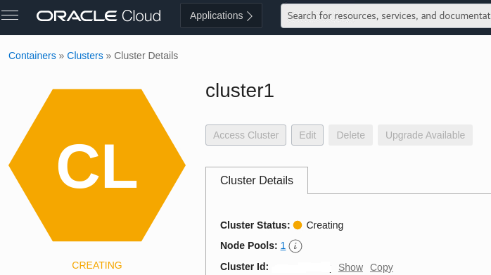
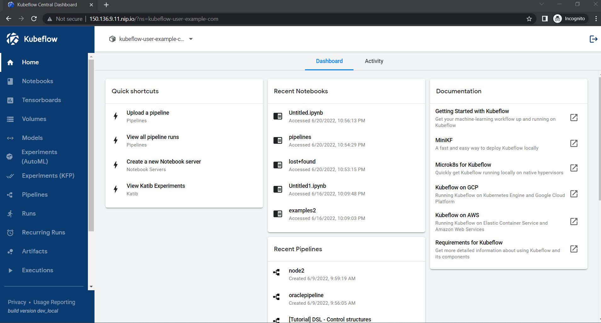

# Kubeflow for Oracle Container Engine for Kubernetes

[uri-kubernetes]: https://kubernetes.io/
[uri-oci]: https://cloud.oracle.com/cloud-infrastructure
[uri-oci-documentation]: https://docs.cloud.oracle.com/iaas/Content/home.htm
[uri-oke]: https://docs.cloud.oracle.com/iaas/Content/ContEng/Concepts/contengoverview.htm
[uri-oracle]: https://www.oracle.com

[](https://img.shields.io/badge/license-UPL-green) [](https://sonarcloud.io/dashboard?id=oracle-devrel_kubeflow-oke)

<!-- ## THIS IS A NEW, BLANK REPO THAT IS NOT READY FOR USE YET.  PLEASE CHECK BACK SOON! -->

## Table of Contents

<!-- toc -->

  - [Introduction](#introduction)
  - [Installation](#installation)
    - [Prerequisites](#prerequisites)
    - [Create OKE](#create-oke)
    - [Install Kubeflow](#install-kubeflow)
    - [Access Kubeflow Dashboard](#access-kubeflow-dashboard)
  - [Notes/Issues](#notesissues)
  - [URLs](#urls)
  - [Contributing](#contributing)
  - [License](#license)

<!-- tocstop -->

## Introduction

Running Kubeflow on [Oracle Container Engine (OKE)][uri-oke].

OKE is [Oracle's][uri-oracle] managed [Kubernetes][uri-kubernetes] service on [Oracle Cloud Infrastructure (OCI)][uri-oci].

## Getting Started

> ⚠️ Kubeflow 1.5.0 is not compatible with Kubernetes version 1.22 and onwards. To install Kubeflow 1.5.0 and older versions, use OKE v1.21.5.

This guide explains how to install Kubeflow 1.6.0 on OKE 1.22.5, 1.23.4 and 1.24.1.

## Installation

This guide describes how to create a Kubernetes cluster using OKE, access OKE, install Kubeflow and expose Kubeflow Dashboard.

### Prerequisites

This guide can be run in many different ways, but in all cases, you will need access to an Oracle Cloud Tenancy and be signed in to it.

The steps described below are executed from the Cloud Shell in the OCI console.

### Create an OKE cluster

<!-- <details><summary><b>Create an OKE cluster manually</b>
</summary> -->

1. In the Console, open the navigation menu and click **Developer Services**. Under **Containers & Artifacts**, click **Kubernetes Clusters (OKE)**.

    

2. On the Cluster List dialog, select the Compartment where you are allowed to create a cluster and then click **Create Cluster**.

    > You must select a compartment that allows you to create a cluster and a repository inside the Oracle Container Registry.

    

3. On the Create Cluster dialog, click **Quick Create** and click **Launch Workflow**.

    

    *Quick Create* will automatically create a new cluster with the default settings and new network resources for the new cluster.

4. Specify the following configuration details on the Cluster Creation dialog (pay attention to the value you place in the **Shape** field):

    * **Name**: The name of the cluster. Accept the default value.
    * **Compartment**: The name of the compartment. Accept the default value.
    * **Kubernetes Version**: The version of Kubernetes. Select the **v1.23.4** version.
    * **Kubernetes API Endpoint**: Determines if the cluster master nodes are going to be routable or not. Select the **Public Endpoint** value.
    * **Kubernetes Worker Nodes**: Determines if the cluster worker nodes are going to be routable or not. Accept the default value **Private Workers**.
    * **Shape**: The shape to use for each node in the node pool. The shape determines the number of CPUs and the amount of memory allocated to each node. The list shows only those shapes available in your tenancy that are supported by OKE.
    * **Number of nodes**: The number of worker nodes to create. Accept the default value **3**.
<br>
    > **Caution**: *VM.Standard.E4.Flex is the recommended shape, but you can adjust based on your requirements and location.*

  
  <!--  -->

1. Click **Next** to review the details you entered for the new cluster.

2. On the Review page, click **Create Cluster** to create the new network resources and the new cluster.

    <!--  -->

    > You see the network resources being created for you. Wait until the request to create the node pool is initiated and then click **Close**.

    

    > The new cluster is shown on the Cluster Details page. When the master nodes are created, the new cluster gains a status of *Active* (it takes about 7 minutes).

    

    

    Now your OKE cluster is ready. You can move to Kubeflow installation.

### Install Kubeflow

# Setup Kubeflow

## Prerequisites

The following tools are required:
- oci-cli,
- kubectl,
- git are integrated

In this guide, we will use the OCI Cloud Shell console, and all these tools are integrated.

### Warning

<!-- - **Kubeflow 1.6.0 is not compatible with version Kubernetes 1.22 and backwards.** -->
- Kustomize (version 3.2.0) ([download link](https://github.com/kubernetes-sigs/kustomize/releases/tag/v3.2.0))
    - Kubeflow 1.6.0 is not compatible with the latest versions of Kustomize.

## Preparation steps

1. Install Kustomize in Cloud Shell

    - Open the OCI Cloud Shell

    - Make sure you are in the top level directory

            cd $HOME

    - Download Kustomize version 3.2.0 and install in into your OCI Cloud Shell environment.

            curl -L -o kustomize https://github.com/kubernetes-sigs/kustomize/releases/download/v3.2.0/kustomize_3.2.0_linux_amd64
            chmod +x ./kustomize

2. Clone the Kubeflow repository version 1.6.0 into your OCI Cloud Shell environment

        git clone -b v1.6-branch https://github.com/kubeflow/manifests.git kubeflow_1.6
        cd kubeflow_1.6

3. Change the default password

    By default email user@example.com and password is 12341234
    
    Generate a password.
    
    **Replace PASSWORD with your own password.**

        PASSWORD=YOURPASSWORD
        kubeflow_password=$(htpasswd -nbBC 12 USER $PASSWORD| sed -r 's/^.{5}//')

    Edit Dex config-map.yaml
  
    Make sure you are in the kubeflow manifests folder.

        cd $HOME/kubeflow_1.6/
        cp common/dex/base/config-map.yaml{,.org}
        cat common/dex/base/config-map.yaml.org | sed "s|hash:.*|hash: $kubeflow_password|" > common/dex/base/config-map.yaml

## Install Kubeflow

1. Access your cluster

  Click Access Cluster on your cluster detail page.
  Accept the default **Cloud Shell Access** and click **Copy** copy the `oci ce cluster create-kubeconfig ...` command and paste it into the Cloud Shell and run the command.
  <!-- > If you installed your cluster using the single-script the access is already set. -->

  

  Verify that the `kubectl` is working by using the `get nodes` command. <br>
  You may need to run this command several times until you see an output similar to the following.

  ```bash
    $ kubectl get nodes
    NAME          STATUS   ROLES   AGE   VERSION
    10.0.10.176   Ready    node    19m   v1.23.4
    10.0.10.203   Ready    node    19m   v1.23.4
    10.0.10.48    Ready    node    19m   v1.23.4
  ```

  > If you see the node's information, then the configuration was successful.

2. Install Kubeflow with a single command

        cd $HOME/kubeflow_1.6 
        while ! $HOME/kustomize build example | kubectl apply -f -; do echo "Retrying to apply resources"; sleep 10; done

> Installation takes about 10 to 15 min.

To check that all Kubeflow-related Pods are ready, use the following commands:

  ```bash
kubectl get pods -n cert-manager
kubectl get pods -n istio-system
kubectl get pods -n auth
kubectl get pods -n knative-eventing
kubectl get pods -n knative-serving
kubectl get pods -n kubeflow
kubectl get pods -n kubeflow-user-example-com
 ```

>It takes about 15 min to have all the containers running.

### Access Kubeflow Dashboard

#### Expose Kubeflow to Internet

Kubeflow v1.6 already deploy a load balancer and expose the dashboard to Internet.

⚠️ Change the password before, and let's forward HTTP to HTTPS with a self-signed certificate.

Change istio-ingressgateway to LoadBalancer

```
cat <<EOF | tee $HOME/kubeflow_1.6/patchservice_lb.yaml
  spec:
    type: LoadBalancer
  metadata:
    annotations:
      oci.oraclecloud.com/load-balancer-type: "lb"
      service.beta.kubernetes.io/oci-load-balancer-shape: "flexible"
      service.beta.kubernetes.io/oci-load-balancer-shape-flex-min: "10"
      service.beta.kubernetes.io/oci-load-balancer-shape-flex-max: "100"
EOF
```
    kubectl patch svc istio-ingressgateway -n istio-system -p "$(cat $HOME/kubeflow_1.6/patchservice_lb.yaml)"

#### Enable HTTPS

  * Generate SSL certificate

  We suggest using https://smallstep.com/

  Make sure you are in the top level directory

    cd $HOME          
    mkdir keys;cd keys
    wget -O step.tar.gz https://dl.step.sm/gh-release/cli/docs-ca-install/v0.20.0/step_linux_0.20.0_amd64.tar.gz
    tar -xf step.tar.gz
    cp step_0.20.0/bin/step .

  Generate root certificate

    cd $HOME/keys
    $HOME/keys/step certificate create root.cluster.local root.crt root.key --profile root-ca --no-password --insecure --kty=RSA

  Get Ingress IP to generate certificate
  
    External_IP=$(kubectl get svc istio-ingressgateway -n istio-system -o=jsonpath="{.status.loadBalancer.ingress[0].ip}")

    cd $HOME/keys
    $HOME/keys/step certificate create $External_IP.nip.io tls-$External_IP.crt tls-$External_IP.key --profile leaf  --not-after 8760h --no-password --insecure --kty=RSA --ca $HOME/keys/root.crt --ca-key $HOME/keys/root.key

  * Create Kubernetes Secret TLS Certificate

        cd $HOME/keys
        kubectl create secret tls kubeflow-tls-cert --key=tls-$External_IP.key --cert=tls-$External_IP.crt -n istio-system    

  * Update Kubeflow API Gateway

  Create API Gateway

        cat <<EOF | tee $HOME/kubeflow_1.6/sslenableingress.yaml
        apiVersion: v1
        items:
        - apiVersion: networking.istio.io/v1beta1
          kind: Gateway
          metadata:
            annotations:
            name: kubeflow-gateway
            namespace: kubeflow
          spec:
            selector:
              istio: ingressgateway
            servers:
            - hosts:
              - "*"
              port:
                name: https
                number: 443
                protocol: HTTPS
              tls:
                mode: SIMPLE
                credentialName: kubeflow-tls-cert
            - hosts:
              - "*"
              port:
                name: http
                number: 80
                protocol: HTTP
              tls:
                httpsRedirect: true
        kind: List
        metadata:
          resourceVersion: ""
          selfLink: ""
        EOF

        kubectl apply -f $HOME/kubeflow_1.6/sslenableingress.yaml
        kubectl get gateway -n kubeflow

Congratulations you installed Kubelow on OKE.

Access $External_IP.nip.io

<!-- > Make sure Security List or NSG give access from outside LB TCP/80 and TCP/443 -->



<!-- ## Notes/Issues
MISSING -->

## URLs

www.kubeflow.org

## Contributing

This project is open source.  Please submit your contributions by forking this repository and submitting a pull request!  Oracle appreciates any contributions that are made by the open source community.

## License

Copyright (c) 2022 Oracle and/or its affiliates.

Licensed under the Universal Permissive License (UPL), Version 1.0.

See [LICENSE](LICENSE) for more details.
